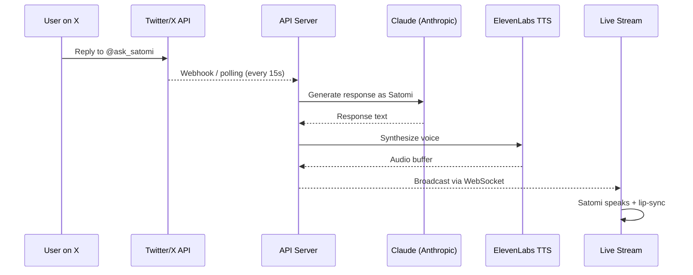
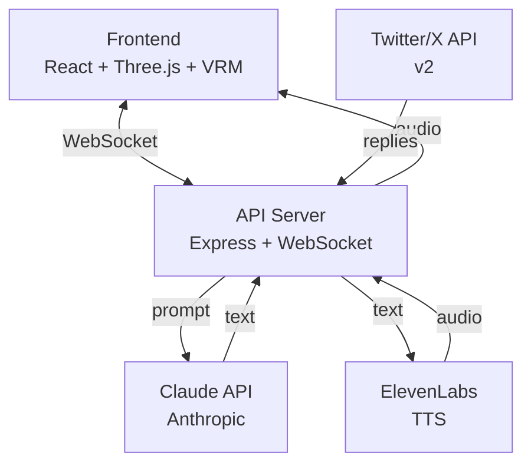

# Satomi Nakamichi

> An anime AI girl livestreaming 24/7 — she reads your tweets and responds live on stream.

**[@ask_satomi](https://x.com/ask_satomi)** · **[satominakamichi.github.io](https://satominakamichi.github.io)**

---

## What is this?

Satomi is an AI character with a 3D anime avatar that streams continuously. She monitors Twitter/X replies in real time, generates responses using a large language model, and speaks them out loud with lip-synced voice — all live, all the time.

No stream schedule. No offline hours. Just ask.

---

## How it works

---

## Architecture

---

## Tech Stack

| Layer | Technology |
|-------|-----------|
| Frontend | React, Three.js, `@pixiv/three-vrm` |
| Styling | Tailwind CSS |
| 3D Character | VRM 0.x with procedural animation |
| API Server | Node.js, Express, WebSocket |
| AI | Anthropic Claude |
| Voice | ElevenLabs TTS |
| Twitter Integration | Twitter/X API v2 |
| Deployment | GitHub Pages (frontend) |

---

## Interact

Tweet or reply to **[@ask_satomi](https://x.com/ask_satomi)** — mention "satomi" in your reply and she'll respond live on stream within seconds.

---

## Live

[**satominakamichi.github.io**](https://satominakamichi.github.io)
